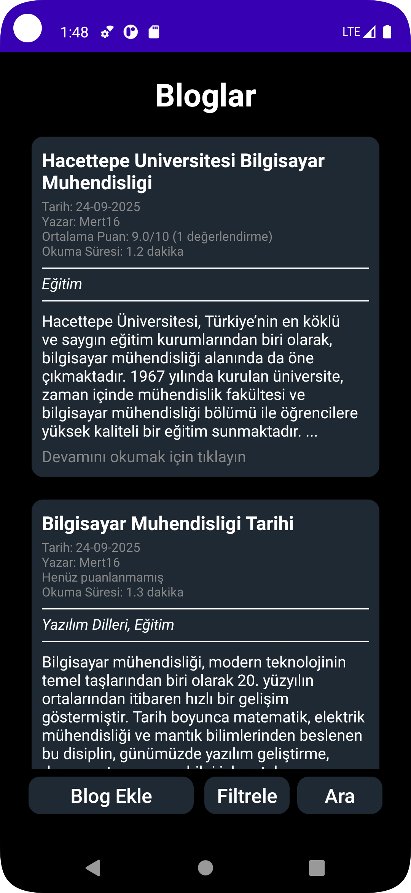
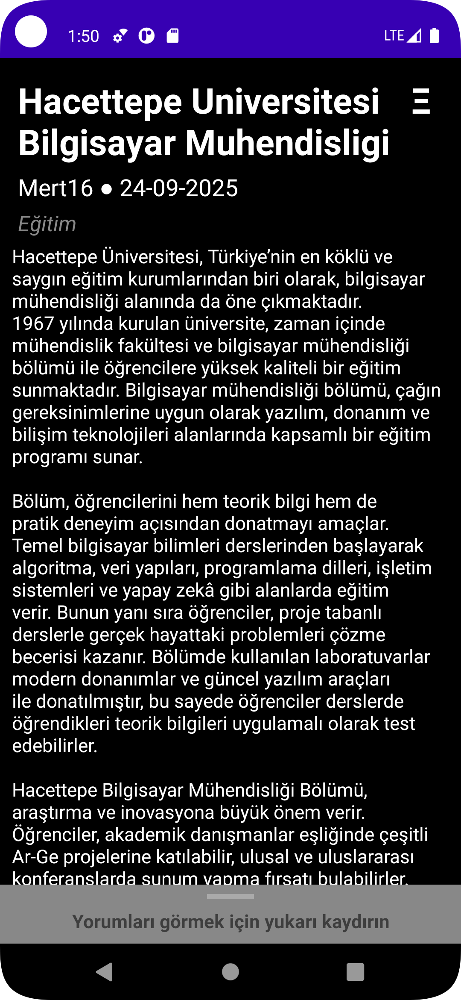
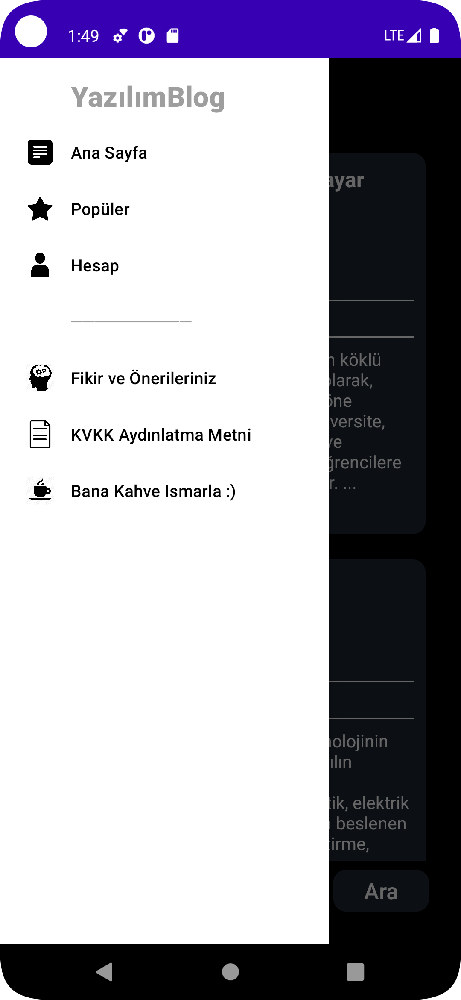
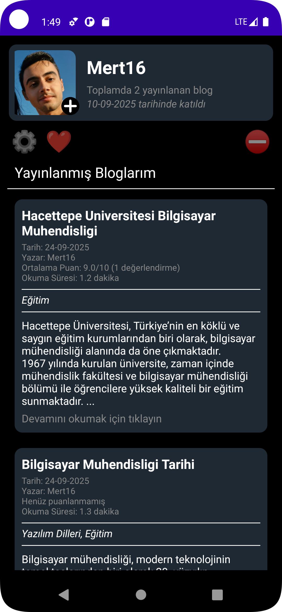
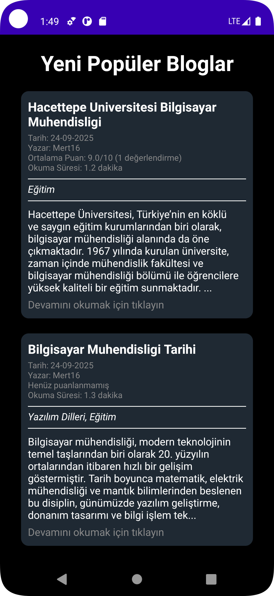
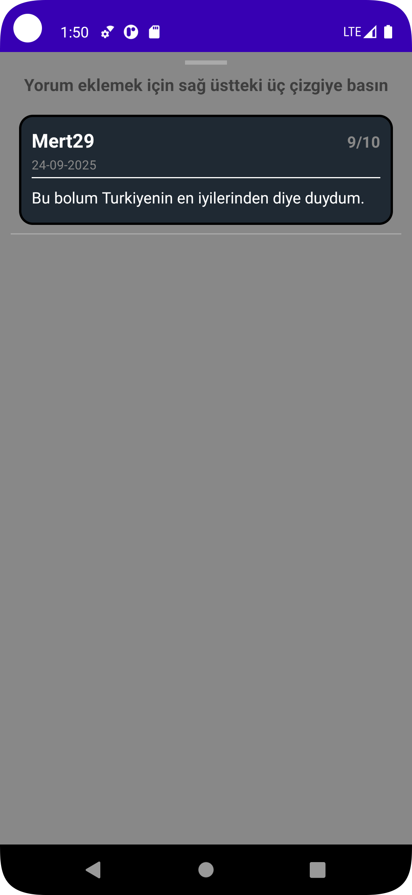
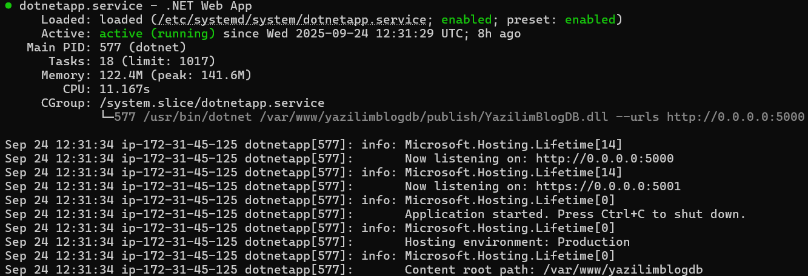
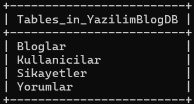

# 📱 YazılımBlog

[]()
[]()
[]()
[]()
[]()
[]()
[]()
[]()

Yazılım meraklıları için blog yazılarının, içeriklerin ve paylaşımların yer aldığı bir Android uygulaması.  
Kullanıcılar blog yazılarını görüntüleyebilir, diğer kullanıcıların bloglarına yorum yapıp puanlayabilir ve yakın zamandaki en yüksek puanlı bloglara erişebilir.

---

## 🚀 Özellikler
- 🔹 Blog yazılarını listeleme  
- 🔹 Kullanıcı hesabı oluşturup blog ekleme, bloglara yorum yapma ve puanlama
- 🔹 Profil fotoğraflarının Firebase Storage üzerinden yüklenmesi ve indirilmesi  
- 🔹 Glide ile hızlı ve verimli görsel gösterimi  
- 🔹 Retrofit ile **.NET backend API** üzerinden veri çekme  
- 🔹 **AWS EC2 üzerinde çalışan backend** sayesinde daimi ve güvenilir servis
- 🔹 Modern ve kullanıcı dostu arayüz  
- 🔹 Navigation drawer menüsü ile kolay geçiş  

---

## 🛠️ Kullanılan Teknolojiler
### 📱 Android (Frontend)
- **Android Studio** – IDE  
- **XML** – Arayüz tasarımı

### 🌐 Backend
- **Firebase Storage** – Görsel yükleme ve depolama  
- **Retrofit** – REST API istemcisi  
- **Glide** – Görsel yükleme kütüphanesi  
- **Java** – Android uygulama geliştirme dili
- **C#** - .NET proje geliştirme dili
- **.NET Core / ASP.NET** – REST API geliştirme  
- **AWS EC2** – Sunucu üzerinde daimi çalışan backend  
- **Nginx / Apache** – Servis yönetimi  
- **MySQL** – Veritabanı yönetimi 

---

## Proje Dizin Yapısı

```
yazlmblog/
│
├── api/
│   ├── ApiClient.java
│   ├── ApiService.java
│   ├── Blog.java
│   ├── Kullanici.java
│   ├── Sikayet.java
│   └── Yorum.java
│
├── ui/
│   ├── blog/
│   │   ├── BlogAdapter.java
│   │   ├── BlogEkle.java
│   │   ├── BlogEkran.java
│   │   ├── EtiketAdapter.java
│   │   ├── EtiketlerList.java
│   │   ├── HomeFragment.java
│   │   └── YorumAdapter.java
│   │
│   ├── hesap/
│   │   ├── Blogger.java
│   │   ├── EmailCheckResult.java
│   │   └── NotificationsFragment.java
│   │
│   └── populer/
│       └── DashboardFragment.java
│
└── MainActivity.java
```

---

## 📸 Uygulamadan Görüntüler
| Ana Sayfa | Blog | Navigasyon |
|-----------|------------|-------------|
|  |  |  |

| Hesap | Popüler | Yorum |
|-----------|------------|-------------|
|  |  |  |

---

## Sunucu Tarafı .NET Servisi Durumu ve MySql Veritabanı Yapısı
| .NET Servisi | MySql Veritabanı Tabloları |
|-----------|------------|
|  |  |

---

## API Servis Arayüzü

Uygulamada Retrofit ile kullanılan `ApiService` arayüzü:

```java
public interface ApiService {

    // Görseller
    @Multipart
    @POST("api/upload")
    Call<ResponseBody> uploadImage(
            @Part MultipartBody.Part image
    );

    @GET("images/{filename}")
    Call<ResponseBody> getImage(@Path("filename") String filename);

    // Kullanıcılar
    @GET("api/Kullanici")
    Call<List<Kullanici>> getKullanicilar();

    @POST("api/Kullanici")
    Call<Kullanici> addKullanici(@Body Kullanici yeniKullanici);

    @DELETE("api/Kullanici/{id}")
    Call<Void> deleteKullanici(@Path("id") String id);

    @PUT("api/Kullanici")
    Call<Kullanici> updateKullanici(@Body Kullanici yeniKullanici);

    // Bloglar
    @GET("api/Blog")
    Call<List<Blog>> getBloglar();

    @POST("api/Blog")
    Call<Blog> addBlog(@Body Blog yeniBlog);

    @DELETE("api/Blog/{id}")
    Call<Void> deleteBlog(@Path("id") int id);

    @PUT("api/Blog")
    Call<Blog> updateBlog(@Body Blog yeniBlog);

    // Yorumlar
    @GET("api/Yorum")
    Call<List<Yorum>> getYorumlar();

    @POST("api/Yorum")
    Call<Yorum> addYorum(@Body Yorum yeniYorum);

    @DELETE("api/Yorum/{id}")
    Call<Void> deleteYorum(@Path("id") int id);

    // Şikayetler
    @GET("api/Sikayet")
    Call<List<Sikayet>> getSikayetler();

    @POST("api/Sikayet")
    Call<Sikayet> addSikayet(@Body Sikayet yeniSikayet);
}

public class ApiClient {
    private static final String BASE_URL = "http://sitennikur.site/";
    private static Retrofit retrofit;

    public static Retrofit getClient() {
        if (retrofit == null) {
            // OkHttpClient
            OkHttpClient client = new OkHttpClient.Builder()
                    .build();

            // Retrofit
            retrofit = new Retrofit.Builder()
                    .baseUrl(BASE_URL)
                    .client(client) // buraya ekledik
                    .addConverterFactory(GsonConverterFactory.create())
                    .build();
        }
        return retrofit;
    }
}
```

---

## KVKK Metni

6698 sayılı Kişisel Verilerin Korunması Kanunu (KVKK) uyarınca, YazılımBlog uygulaması olarak kullanıcılarımızın kişisel verilerini aşağıda açıklanan çerçevede işlemekteyiz.

1. Veri Sorumlusu  
YazılımBlog  
E-posta: mert.kadakal1629@gmail.com  
Adres: Hacettepe Üniversitesi, ANKARA/Çankaya  

2. İşlenen Kişisel Veriler  
- Kullanıcı adı  
- Kullanıcı profil fotoğrafı  
- E-posta adresi  
- Telefon numarası  

3. Kişisel Verilerin İşlenme Amaçları  
- Uygulama hizmetlerinin sunulabilmesi ve yönetilmesi  
- Kullanıcı hesaplarının oluşturulması ve yönetimi  
- Kullanıcı deneyiminin iyileştirilmesi  
- Yasal yükümlülüklerin yerine getirilmesi  

4. Kişisel Verilerin Aktarılması  
Toplanan kişisel verileriniz, yalnızca yasal zorunluluklar veya hizmetin gereklilikleri çerçevesinde iş ortaklarımızla paylaşılabilir.  

5. Kişisel Verilerin Saklanma Süresi  
Verileriniz, işleme amaçlarının ortadan kalkmasına veya ilgili mevzuatta öngörülen sürelerin dolmasına kadar saklanacaktır.  

6. Kullanıcı Hakları  
KVKK’nın 11. maddesi uyarınca kullanıcılar;  
- Kişisel verilerinin işlenip işlenmediğini öğrenme,  
- İşlenmişse buna ilişkin bilgi talep etme,  
- İşlenme amacını öğrenme,  
- Eksik veya yanlış işlenmişse düzeltilmesini isteme,  
- Silinmesini veya anonimleştirilmesini isteme,  
- İşlemeye itiraz etme  

haklarına sahiptir.  

7. Başvuru Yöntemi  
Haklarınızı kullanmak için taleplerinizi mert.kadakal1629@gmail.com üzerinden iletebilirsiniz.

